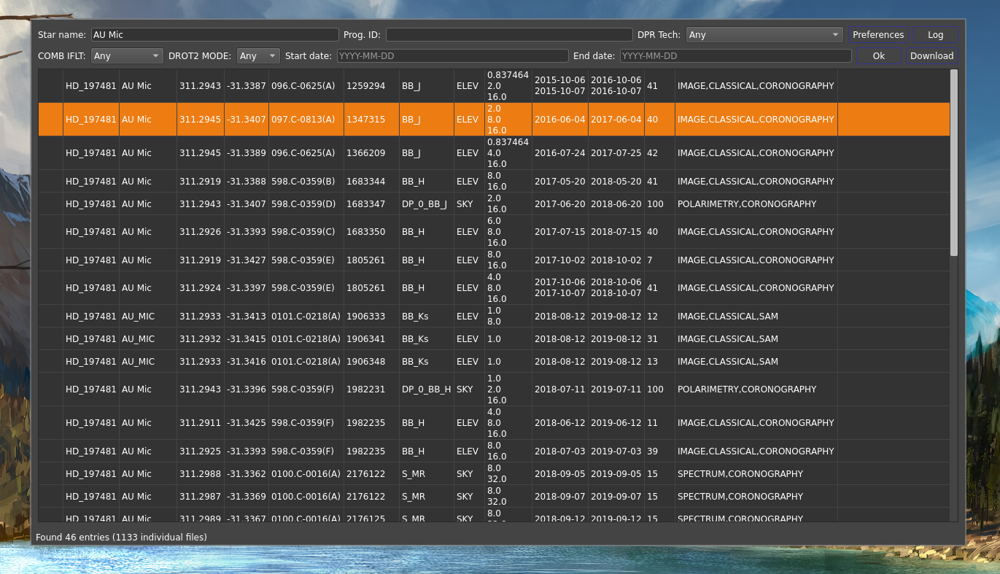

# SphereQuery



Package to browse and explore the ESO VLT/SPHERE archive.

```python

astropy==5.0.4
astroquery==0.4.6
imutils==0.5.4
numpy==1.17.4
PyQt5==5.15.9
pyvo==1.3
requests==2.22.0
scikit_learn==1.2.2
sphere==0.3.1
vlt_sphere==1.5.1

```


